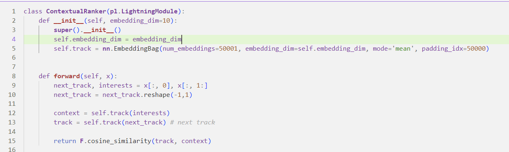
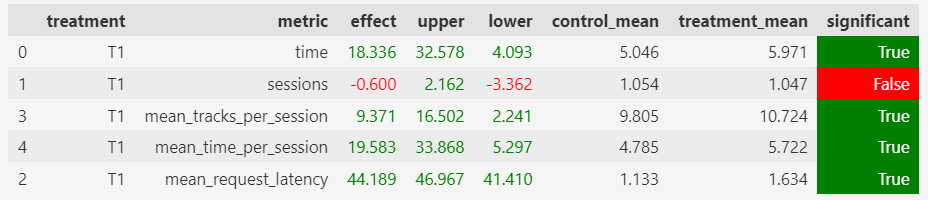

# Эксперименты

Всего я провел несколько экспериментов с 2 моделями. Только одна показала улучшение. Ниже описаны обе, результаты прикреплены только по работающей модели.

## Модель с иторией
### Идея
Обучить эмбеддинги для треков так, чтобы по какой-то метрике (расстояния) в векторном пространстве ближе лежали те треки, которые больше нравятся юзерам.

### Модель

1. Модель имеет одно пространство эмбеддингов треков, из которого берется вектор контекста и ветор текущего трека. 
2. Вектор контекста это усреднение по трекам пользователя, которые он слушал дольше 0.8
3. Косинусное расстояние между треком и контестом - предсказание времени прослушивания.
4. Recommender так же хранит историю прослушивания и старается выдавать всегда новыке треки и новых исполнителей (без повторений).

### Результаты

## Модель с кластеризацией
### Идея
Обучить эмбеддинги для треков, учитывая информацию о пользователе. Чтобы модель не разрасталась сначала обучаются эмбеддинги для юзеров, кластеризуются и после информация о кластере используется непосредственно для треков.

### Модель
1. Обучается модель с 3 эмбеддингами: треки, контекст и юзеры. В качестве контекста выбирается последний терк, время прослушивания которого превышает 0.8.
2. Треки и контекст - векторы длины `n`, юзер длины `2n`. Выход модели - скалярное произведение stacked вектора трека и контекста с вектором юзера.
3. Из полученной модели забираем ембединги для юзеров и запускаем кластеризацию без использования пространственных метрик (прим. AffinityPropagation).
4. На полученных центрах кластеров запускаем новую кластеризацию и тюним пока не получим оптимальные (по выбранной для кластеризаций метрик) кластеры.

> Первая кластеризация проходит без подбора числа кластеров. Сколько найдёт алгоритм, столько и будет. Вторая нужна для уменьшения числа кластеров.

5. Делим юзеров на кластеры и обучаем контекст модель с учетом разбиения на кластеры.

### Результаты
Модель работала сильно хуже обычной контекстной.
Скорее всего скалярное произведение не подходит для обучения embeddings в данном примере и стоило подумать над таким преобразованием, которое позволяло сближать по какой-нибудиь метрике юзеров в пространстве эмбеддингов.

Так же стоило более подробно изучить кластеризации, потыкать в разные методы и параметры.